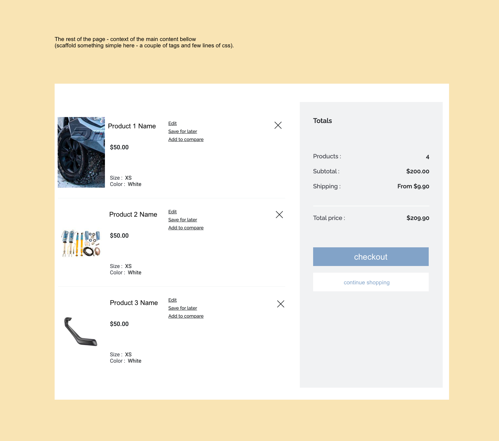

# Vue Storefront Code Challenge

## Introduction

### Vue Storefront

Vue Storefront is essentially a [Nuxt.js](https://nuxtjs.org/) project with some plugins and modules preinstalled, as well as a ready-to-use e-commerce theme. [Nuxt.js](https://nuxtjs.org/) handles most of the front-end work and Server Side Rendering, while Vue Storefront adds the e-commerce specific bits and integrations to various platforms.

**Note** - Vue Storefront uses Nuxt.js 2, not Nuxt.js 3 which is currently in beta.

### Storefront UI

On top of Vue Storefront is a UI library known as [Storefront UI](http://storefrontui.io/). It contains heavily customisable components following the Atomic Design pattern. As you explore this project's components and pages, you will see that every component being used has a prefix of `Sf`, these components are imported directly from [Storefront UI](http://storefrontui.io/).

It is highly recommended to read through the [Storefront UI docs](https://docs.storefrontui.io/?path=/story/welcome--page), as you will be using these components a lot in this code challenge.

## Pre-requisites

Ensure you have the following installed on your computer:

- [Git](https://git-scm.com/downloads)
- [Google Chrome](https://www.google.com/intl/en_au/chrome/) (we will be using this browser to check your awesome work, so please use this during development)
- [nvm](https://github.com/nvm-sh/nvm#installing-and-updating) - Node Version Manager. This is how we will install Node.js and ensure we are using the correct version as specified in the project.

  ```bash
  curl -o- https://raw.githubusercontent.com/nvm-sh/nvm/v0.39.1/install.sh | bash
  ```

  **For Windows users**

  If you are on Windows, you can use [nvm-windows](https://github.com/coreybutler/nvm-windows#installation--upgrades).

  Ensure that you do not have any pre-existing Node.js installations on your computer before installing `nvm-windows`.

  Download, extract and run `nvm-setup.exe` from [`nvm-setup.zip`](https://github.com/coreybutler/nvm-windows/releases/download/1.1.9/nvm-setup.zip).

## Setting up the development environment

1. Fork this repository: https://gitlab.com/sparesbox/vue-storefront-code-challenge.

2. Ensure that you are on the `main` branch and create a branch from the main branch and name it using the following convention `challenge/<your-full-name>`

   ```bash
   git checkout main

   # Replace `john-smith` with your full name

   git checkout -b challenge/john-smith
   ```

3. Change directory into the cloned repository and install the specified Node version in `.nvmrc`, in this case it is `v14.17.5`.

   ```bash
   nvm install v14.17.5
   ```

4. Install dependencies (don't worry if the loader seems to be frozen -- this can take up to 5 minutes to install)

   ```bash
   npm i
   ```

5. Start the development server

   ```bash
   npm run dev
   ```

   This will display a box in your terminal that will have a URL to go to view the project. Open this URL in Google Chrome.

   ```bash
   ╭───────────────────────────────────────────╮
   │                                           │
   │   Nuxt @ v2.15.8                          │
   │                                           │
   │   ▸ Environment: development              │
   │   ▸ Rendering:   server-side              │
   │   ▸ Target:      server                   │
   │                                           │
   │   Listening: http://{ip_address}:3001/    │
   │                                           │
   ╰───────────────────────────────────────────╯
   ```

## Project structure

- `/components` - contains re-usable Vue components used on different pages. These can be imported into any page or layout, or even other other components. Read more about the [components directory here](https://nuxtjs.org/docs/directory-structure/components).

- `/composables` - contains typed [Vue composables](https://v3.vuejs.org/guide/composition-api-introduction.html), which are used to perform repeated UI actions such as opening a sidebar or searching for an item.

  - For an example implementation of one of these composables, refer to [AppHeader.vue](./components/AppHeader.vue).

- `/lang` - contains translations for your application. Available locales are configured in the nuxt.config.js file.

- `/layouts` - high-level Vue components that act as the base for the whole application or specific pages.

- `/middleware` - contains custom functions that can be run before rendering a page or group of pages.

  - One middleware which is provided by Vue StoreFront [authenticated.js](./middleware/authenticated.js) does a simple authentication check of a cookie. If the cookie does not exist, the user gets redirected to the home page if they attempt to access a restricted route.

- `/pages` - The pages directory reads all the .vue files inside this directory and automatically creates the pages and routes (as slugs) for you. Read more about the [pages directory here](https://nuxtjs.org/docs/directory-structure/pages/).

  - Take note of the use of the library [`vue-lazy-hydration`](https://github.com/maoberlehner/vue-lazy-hydration#vue-lazy-hydration) (i.e. the component `LazyHydrate`) in these pages.

- `/plugins` - The plugins directory contains your Javascript plugins that you want to run before instantiating the root Vue.js Application.

- `/static` - The static directory is directly mapped to the server root and contains files that likely won't be changed. All included files will be automatically served by Nuxt and are accessible through your project root URL.

- `/store` - The store directory contains your Vuex Store files. The Vuex Store comes with Nuxt out of the box.

- `nuxt.config.js` - The nuxt.config.js file is the starting point of every project. It contains general configuration, including routes, global middlewares, internationalization, or build information. This file also registers modules and plugins to add or extend framework features.

- `middleware.config.js` - The middleware.config.js file is as essential as nuxt.confis.js, but much simpler and likely smaller. It configures the Server Middleware used for communication with e-commerce platforms and contains sensitive credentials, custom endpoints, queries, etc.

- `/stubVueStorefrontIntegration` - This is a stub e-commerce integration that is used to locally send data to Nuxt.js.

  - Read up on how Vue Storefront composables work [here](https://docs.vuestorefront.io/v2/integrate/integration-guide.html#composables).

  - There are two mocked composables:

    - `useCategories` - stub data is returned for a list of all categories.
    - `useCart` - stub data is returned for a list of all products in the cart.

## The challenge

Create a cart page according to the given design.

The page component is [Cart.vue](./pages/Cart.vue) which routes to the path `/cart`.



Use existing components from the Storefront UI library.

Load the products from the user's cart -- use hard-coded (stub) data for this, loaded from an integration stub composable.

Refer to the following for examples:

- [Categories.vue](./pages/Categories.vue), uses the [useCategory composable](./stubVueStorefrontIntegration/composables/index.js) to load all the categories from the stub integration
- [Home.vue](./pages/Home.vue), uses the [useContent composable](./stubVueStorefrontIntegration/composables/index.js) to load the home content from the stub integration

Update the totals on the side:

- Products (number of products)
- Subtotal
- Total price

You do not need to implement any other functionality such as the Edit, Save for later, Add to compare or the removal of each product.

**Regularly commit your work** so a clean git history can be seen and we can understand your workflow.

## Submitting your work

Push your branch to the forked repository then create a Merge Request pointing back to the origin repository.

Try to spend no more than 4 hours on this task.
